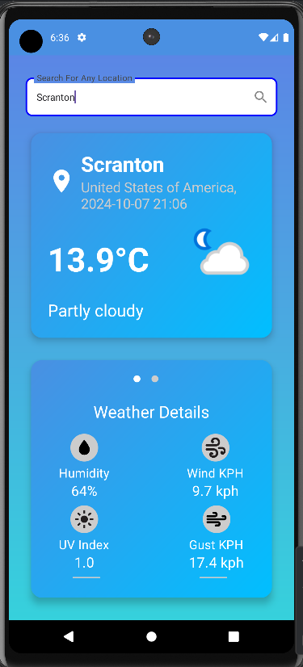

# Weather App

A simple weather application built with Kotlin and Jetpack Compose that fetches real-time weather data using the Free Weather API. The app uses Retrofit for making API requests.

## Features

- **Real-time Weather Data**: Fetches current weather conditions based on the user's selected city.
- **Jetpack Compose UI**: A modern UI using Kotlin's Jetpack Compose for a declarative and efficient design.
- **API Integration**: Uses Retrofit to interact with the Free Weather API for fetching weather data.

## Technologies Used

- **Kotlin**: Primary programming language for Android development.
- **Jetpack Compose**: For building the app's UI.
- **Retrofit**: For making HTTP requests and interacting with the weather API.
- **Free Weather API**: A free service providing real-time weather data.

## Installation

1. Clone the repository:
   ```bash
   git clone https://github.com/SarthakShrivastav-a/RealTime-Weather-App.git
   ```
2. Open the project in Android Studio.
3. Build the project.
4. Get an API key from the Free Weather API [here](https://www.weatherapi.com/) and add it to your project.
   - You can store the API key in a `local.properties` file or hardcode it in your Retrofit client for testing purposes.
5. Run the app on an emulator or a physical device.

## Usage

1. Select or enter a city.
2. The app will display the current weather information such as temperature, humidity, and weather conditions.

## API Setup

- **API Base URL**: `https://api.weatherapi.com`
- Ensure that the API key is correctly configured in the Retrofit client.

```kotlin
val retrofit = Retrofit.Builder()
    .baseUrl("https://api.weatherapi.com")
    .addConverterFactory(GsonConverterFactory.create())
    .build()
```

## Screenshots




## License

This project is licensed under the MIT License. See the `LICENSE` file for more details.

---


